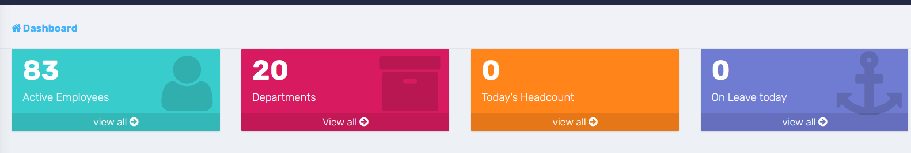

### **DASHBOARD**

### **Data Loaded on the dashboard**

- **Attendance Data**: Displays attendance records for the current day.
- **Employee Performance**: Shows the average performance rating of employees.
- **Employee Awards**: Displays the total awards received by the logged-in employee.
- **Notices**: Lists all published notices.
- **Leave Applications**: Displays pending leave applications for employees under the supervisor.
- **Employee Information**: Loads the details of the logged-in employee.
- **Warnings**: Lists warnings issued to the logged-in employee.
- **Upcoming Birthdays**: Displays employees with birthdays in the current month. Currently can be viewed by all employees.
- **Activity Logs**: Shows recent activity logs when the user has the permissions.

### **CARDS**

1. **Active employees** - Show the total number of employees in the system. If branch/location permission are enabled, it shows only those that are in the current branch/location of the logged in employee and the employees who are in the branch where the user is granted permissions.
2. **Departments** - Shows the number of departments in the whole organization
3. **Today's Headcount** - Shows the total number of employee present today. If branch/location permissions are enabled, it will show the headcount of the locations/locations where the user has permissions to access. - Internal Change request, remove today's attendance from the main dashboard.
4. **On Leave Today** - Shows the total who are on leave. This only counts for those employees whose leaves are so far fully approved at all stages. It only counts if the employee leave day fall on today's date.

More items on the display.

- Activity Logs,
- Pending leave applications - **_to do_** - Change the leave application to only load for users who are the approvers of the said leaves.
- Shortcuts - Manage Employees, Payroll, Attendance, Leave Management,

NOTES ON PERMISSIONS

- The content on the dashboard is controlled by permissions. If the logged in user does not have the right permissions, the will not be able to see the various sections/cards on the dashboard.
